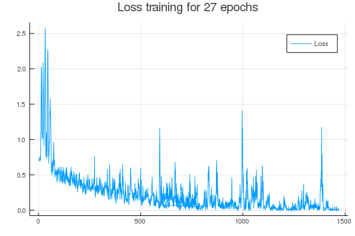
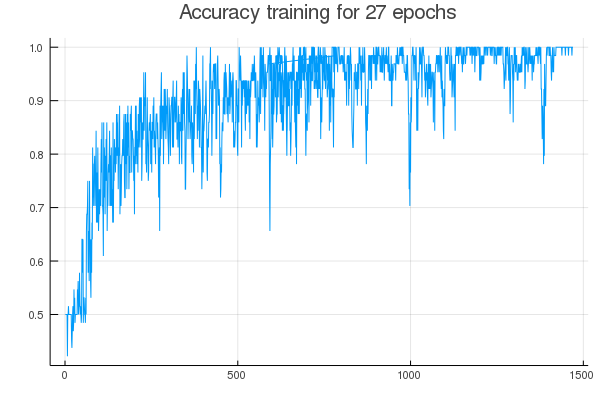

# Dog-or-Cat-image-classifier

Simple image classifier between images of dogs and cats, using the package [Flux](https://github.com/FluxML/Flux.jl).

## Model

I used a partial version of the vgg19 model, but with a shape size for the images of (64, 64), due to low gpu memory, and a batch size of 64.

## Results

The accuracy was tested using 1,000 pictures of dogs and 1,000 of cats that were not used during the training. The max accuracy reached was of 0.813 (81.3%). And the minimum loss was of 0.0003631989.

The accuracy of the training data reached several times the 100%.

